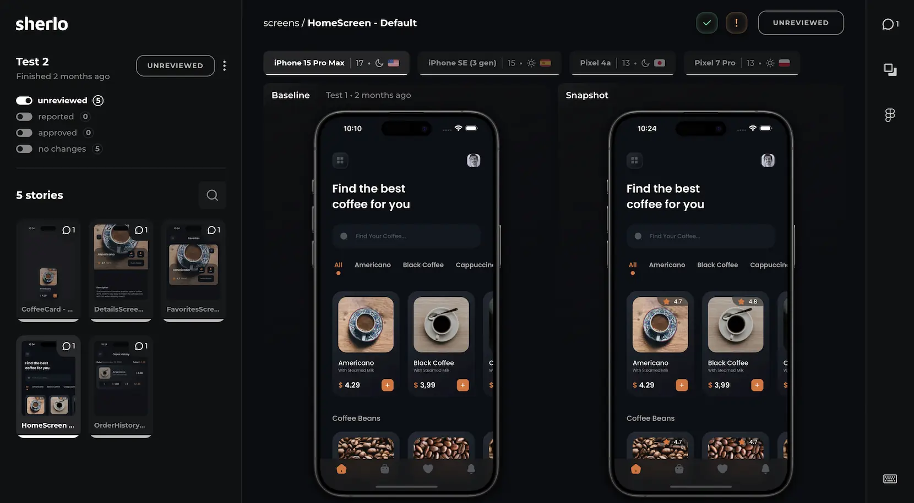

  <a href="https://sherlo.io/">
    <picture>
      <source media="(prefers-color-scheme: dark)" srcset="./assets/logo-dark.svg">
      
    </picture>
  </a>

Visual Testing & Review Tool for React Native Storybook

 

    

## ℹ️ About

[Sherlo](https://sherlo.io) is a Cloud-based Visual Testing and Review Tool that integrates
with [Storybook for React Native](https://github.com/storybookjs/react-native).

Designed to detect every change in your UI components, Sherlo empowers your team to confidently release apps with no
visual bugs.

Discover more on the [Sherlo website](https://sherlo.io).

 

## 📖 Documentation

Visit the [Sherlo Docs](https://docs.sherlo.io) for a detailed guide on integrating Sherlo with your
projects.

 

## 📦 Packages

- [@sherlo/react-native-storybook](packages/react-native-storybook): Integration with React Native Storybook
- [@sherlo/cli](packages/cli): Command-line tool for running Sherlo tests
- [@sherlo/action](packages/action): GitHub Action for automating Sherlo tests

 

## 💡 Examples

- [expo-example](examples/expo-example): Expo project with Sherlo integration

 

## 🤝 Contributions

Contributions are welcome!

Fork the repository, make your changes, and submit a pull request.
 
For significant updates, please first open an issue to discuss proposed changes.

 

## ©️ License

[MIT](LICENSE)
