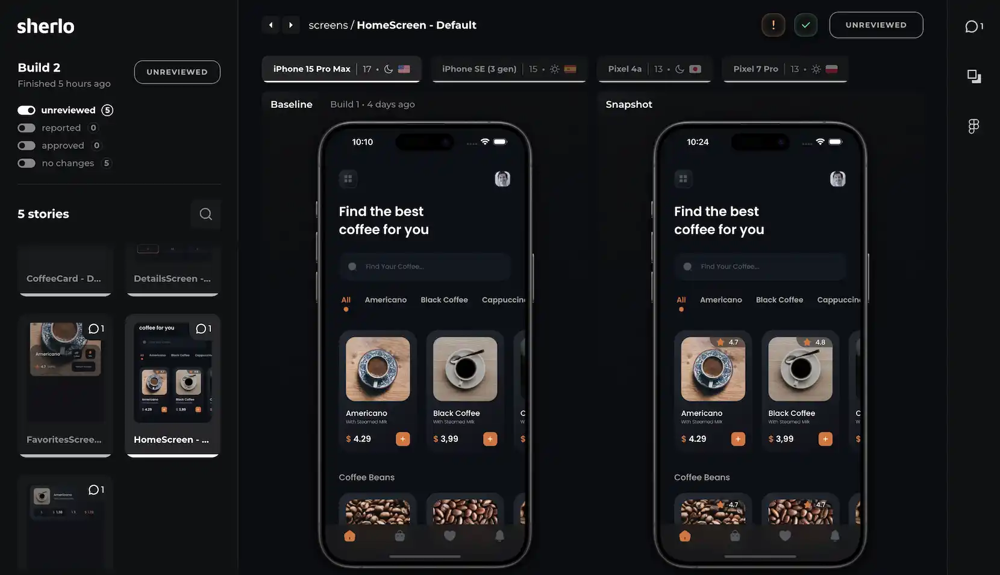

<p align="center">
  <a href="https://sherlo.io/">
    <picture>
      <source media="(prefers-color-scheme: dark)" srcset="./assets/logo-dark.svg">
      
    </picture>
  </a>
</p>

<p align="center">Visual Testing & Review Tool for React Native Storybook</p>

<br />

<div align="center">
    
</div>

## ℹ️ About

Sherlo is a Cloud-based **Visual Testing and Review Tool** that integrates with [React Native Storybook](https://github.com/storybookjs/react-native)

Designed to detect every change in your UI components, Sherlo empowers your team to confidently release apps with no visual bugs

Discover more on the [Sherlo website](https://sherlo.io)

<br />

## ✨ Demo

See Sherlo in action and try it yourself in our [live demo](https://app.sherlo.io/demo)

Experience how visual testing can transform your development workflow and help maintain UI consistency

<br />

## 🚀 Quick Start

Add Sherlo to your project in seconds:

```bash
npx sherlo@latest init
```

<br />

## 📖 Documentation

Visit the [Sherlo Docs](https://docs.sherlo.io) for a detailed guide on integrating Sherlo with your projects

<br />

## 📦 Packages

- [sherlo](packages/cli): Command-line tool for project integration and running visual tests
- [@sherlo/react-native-storybook](packages/react-native-storybook): Integration with React Native Storybook

<br />

## ©️ License

[MIT](LICENSE)
