# CLI Architecture

The `sherlo` CLI orchestrates visual test runs from the developer's machine or CI.

## Entry Point

`packages/cli/cli.js` → `packages/cli/src/index.ts` (Commander.js)

## Commands

| Command | Entry | Purpose |
|---------|-------|---------|
| `sherlo test` | `commands/test/` | Run visual tests with local builds |
| `sherlo init` | `commands/init/` | Initialize project config |
| `sherlo test-eas-update` | `commands/testEasUpdate/` | Run tests with Expo EAS Update (OTA) |
| `sherlo eas-build-on-complete` | `commands/easBuildOnComplete/` | Hook for EAS Build completion |
| `sherlo upload` | `commands/upload/` | Upload builds without running tests |

## Test Command Flow

```mermaid
flowchart LR
    Dev(🧑‍💻 Developer) -->|npx sherlo test| CLI(📦 CLI)
    CLI -->|validate| Config(📦 Config)
    Config --> Binary(📦 Upload)
    Binary -->|presigned URL| S3(☁️ S3)
    S3 --> API(⚡ openBuild)
    API -->|poll| Poll(📦 Poll)
    Poll -->|display| Results(✅ Results)
```

**Legend:** 🧑‍💻 Developer = user, 📦 CLI = sherlo CLI, 📦 Config = sherlo.config.ts, ☁️ S3 = AWS S3, ⚡ openBuild = sherlo-api mutation, 📦 Poll = status polling, ✅ Results = test results

## Detailed Flow

1. **Parse arguments** — Commander.js parses CLI flags + `sherlo.config.ts`
2. **Validate config** — Check devices, platforms, project token via `getValidatedCommandParams()`
3. **Get build info** — Call `getNextBuildInfo` GraphQL query for build index and binary reuse info
4. **Upload binaries** — If new builds needed, upload APK/IPA to S3 via presigned URLs from `getBuildUploadUrls`
5. **Open build** — Call `openBuild` mutation with build config, git info, device list
6. **Poll results** — Periodically check build status until complete or timeout
7. **Display results** — Show pass/fail summary with link to dashboard

## API Communication

Uses `@sherlo/sdk-client` (GraphQL client built on aws-appsync-auth-link):

- **Queries:** `getNextBuildInfo`
- **Mutations:** `openBuild`, `closeBuild`, `getBuildUploadUrls`, `asyncUpload`
- **Auth:** Project API token (no Cognito — public SDK access)

## Token Format

Project token encodes: `apiToken + teamId + projectIndex` (parsed by `getTokenParts()`)

## User Journey: Running Tests in CI

1. **CI** runs `npx sherlo test --token $SHERLO_TOKEN`
2. **CLI** reads `sherlo.config.ts` for devices and platform config
3. **CLI** uploads APK/IPA to S3 (or reuses previous builds if unchanged)
4. **CLI** calls `openBuild` → build queued in sherlo-api
5. **Runner** picks up job, captures screenshots
6. **CLI** polls until complete, exits with pass/fail code
