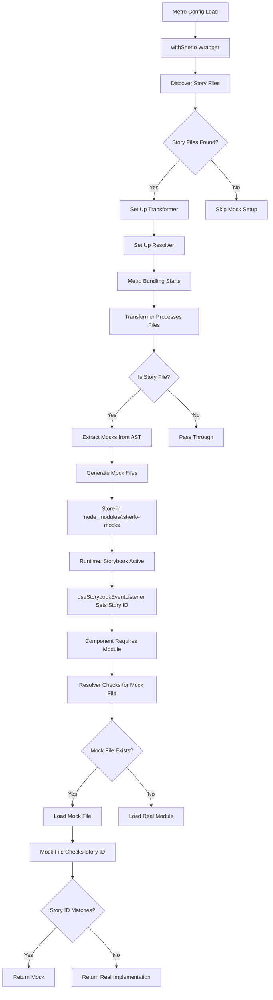
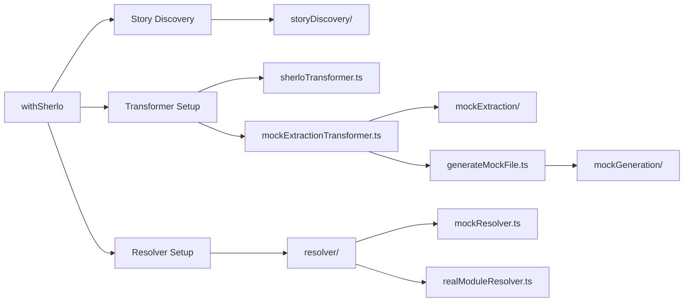

# Mock System for React Native Storybook

## Overview

The mock system enables dynamic, per-story mocking of modules in React Native Storybook. It allows you to define mocks directly in your story files and automatically serves the correct mock based on the currently active story, without requiring bundle reloads or manual mock setup.

## Key Features

- **Per-Story Mocks**: Define different mocks for different story variants
- **Automatic Discovery**: Automatically discovers all story files and extracts mocks
- **Runtime Resolution**: Mocks are resolved at runtime based on the active story ID
- **Zero Production Impact**: Never affects production code - mocks only work in Storybook mode
- **Type-Safe**: Full TypeScript support
- **Project-Agnostic**: Works with any project structure, including monorepos

## Architecture

### High-Level Flow



### Component Architecture



## Installation

The mock system is automatically available when you use `@sherlo/react-native-storybook`. No additional installation required.

## Configuration

### Basic Setup

Add `withSherlo` to your Metro configuration:

```javascript
// metro.config.js
const { getDefaultConfig } = require('expo/metro-config'); // or 'metro-config'
const withSherlo = require('@sherlo/react-native-storybook/metro/withSherlo');

const config = getDefaultConfig(__dirname);
module.exports = withSherlo(config);
```

**Important**: `withSherlo` must be called **after** `withStorybook`:

```javascript
const { getDefaultConfig } = require('expo/metro-config');
const { withStorybook } = require('@sherlo/react-native-storybook/metro');
const withSherlo = require('@sherlo/react-native-storybook/metro/withSherlo');

const config = getDefaultConfig(__dirname);
module.exports = withSherlo(withStorybook(config));
```

## Usage

### Defining Mocks in Stories

Mocks are defined using a `mocks` property in your story object:

```typescript
// Button.stories.tsx
import { Button } from './Button';

export const Basic = {
  mocks: {
    'expo-localization': {
      getLocales: () => [{ languageCode: 'en', countryCode: 'US' }],
    },
  },
  component: Button,
};

export const Polish = {
  mocks: {
    'expo-localization': {
      getLocales: () => [{ languageCode: 'pl', countryCode: 'PL' }],
    },
  },
  component: Button,
};
```

### Mocking Local Imports

You can mock local imports using relative paths:

```typescript
export const WithLocalMock = {
  mocks: {
    '../utils/helper': {
      getValue: () => 'mocked value',
    },
  },
  component: MyComponent,
};
```

### Mocking Default Exports

```typescript
export const WithDefaultMock = {
  mocks: {
    '../utils/testHelper': {
      default: {
        getValue: () => 'mocked default',
      },
    },
  },
  component: MyComponent,
};
```

### Mocking Multiple Named Exports

```typescript
export const WithMultipleMocks = {
  mocks: {
    'some-package': {
      functionA: () => 'A',
      functionB: () => 'B',
      constantC: 'C',
    },
  },
  component: MyComponent,
};
```

### Mocking Async Functions

```typescript
export const WithAsyncMock = {
  mocks: {
    '../utils/api': {
      fetchUserData: async (id: string) => {
        return { id, name: 'Mocked User' };
      },
    },
  },
  component: MyComponent,
};
```

### Mocking Classes

```typescript
export const WithClassMock = {
  mocks: {
    '../utils/processor': {
      DataProcessor: class {
        process(data: any) {
          return 'mocked result';
        }
      },
    },
  },
  component: MyComponent,
};
```

### Complex Object Mocks

```typescript
export const WithObjectMock = {
  mocks: {
    'some-package': {
      config: {
        apiUrl: 'https://mock.api',
        timeout: 5000,
        nested: {
          value: 'deep',
        },
      },
    },
  },
  component: MyComponent,
};
```

### Special Values

The system handles special JavaScript values correctly:

```typescript
export const WithSpecialValues = {
  mocks: {
    '../utils/math': {
      nan: NaN,
      infinity: Infinity,
      negativeInfinity: -Infinity,
      date: new Date('2024-01-01'),
      regex: /test/g,
    },
  },
  component: MyComponent,
};
```

### No Mocks Variant (Fallback to Real)

If a story doesn't define mocks, or if a specific package isn't mocked, the system automatically falls back to the real implementation:

```typescript
export const NoMocks = {
  // No mocks defined - all imports use real implementations
  component: MyComponent,
};
```

## How It Works

### 1. Story Discovery

When Metro starts, `withSherlo` discovers all story files by:
1. Reading Storybook's `main.ts`/`main.js` configuration
2. Or reading the generated `storybook.requires.ts` file
3. Expanding glob patterns to find all `.stories.?(ts|tsx|js|jsx)` files

### 2. Mock Extraction

During Metro bundling, the transformer:
1. Processes each file through Metro's transformation pipeline
2. Identifies story files
3. Parses the transformed JavaScript code using Babel AST
4. Extracts `mocks` objects from story definitions
5. Stores mocks in a global cache (shared across Metro workers via JSON files)

### 3. Mock File Generation

After extracting mocks, the system:
1. Groups mocks by package/module name
2. Generates a mock file for each mocked package in `node_modules/.sherlo-mocks/`
3. Each mock file contains:
   - All mocks for that package across all stories
   - Runtime logic to select the correct mock based on story ID
   - Fallback logic to use real implementation when no mock matches

### 4. Runtime Resolution

When a component requires a module:
1. Metro's resolver checks if a mock file exists for that module
2. If a mock file exists, it redirects the import to the mock file
3. The mock file checks `__SHERLO_CURRENT_STORY_ID__` (set by `useStorybookEventListener`)
4. If a mock exists for the current story ID, it returns the mock
5. Otherwise, it falls back to the real module implementation

### 5. Story ID Tracking

`useStorybookEventListener` hook:
1. Listens to Storybook's internal channel events
2. Sets `__SHERLO_CURRENT_STORY_ID__` when stories change
3. Only runs when Storybook is active (checks for `view._channel`)

## Production Safety

### Safety Guarantees

The mock system is designed with production safety as a core principle. **Mocks never affect production code** and have **zero runtime overhead** when Storybook is not active.

#### 1. Mocks Never Returned in Production

**Mechanism**: All mock files check `getCurrentStory()` which returns `null` when:
- `__SHERLO_CURRENT_STORY_ID__` is not set (production app)
- `__SHERLO_CURRENT_STORY_ID__` is `undefined` (production app)
- Storybook is not running

**Code Pattern**:
```javascript
const getCurrentStory = () => {
  const storyId = (typeof global !== 'undefined' && global.__SHERLO_CURRENT_STORY_ID__) || null;
  return storyId;
};

// In all property generators:
const storyId = getCurrentStory();
if (storyId && storyMocks[storyId] && storyMocks[storyId][exportName]) {
  // Return mock
} else {
  // ALWAYS falls back to real implementation
  return realModule[exportName] || require('package:real')[exportName];
}
```

**Verification**: ✅ **SAFE** - When `storyId` is `null`, mocks are never returned. All code paths fall back to `realModule`.

#### 2. Story ID Only Set in Storybook Mode

**Mechanism**: `__SHERLO_CURRENT_STORY_ID__` is ONLY set when:
- Storybook's `view._channel` exists (Storybook is active)
- Storybook events fire (`STORY_PREPARED`, `SET_STORY_INDEX`)

**Code**:
```typescript
const view = (global as any).view;
const channel = view?._channel;

if (!channel) {
  return; // Early exit - Storybook not active
}

// Only sets storyId if channel exists
const storeStoryId = (storyId: string) => {
  (global as any).__SHERLO_CURRENT_STORY_ID__ = storyId;
};
```

**Verification**: ✅ **SAFE** - In production apps without Storybook, `view._channel` doesn't exist, so `useStorybookEventListener` exits early and never sets `__SHERLO_CURRENT_STORY_ID__`.

#### 3. Mock Files Only Created When Story Files Exist

**Mechanism**: 
- Mock files are only generated when story files are discovered
- Mock files are only generated during Metro bundling (build time)
- If no story files exist, no mock files are created

**Verification**: ✅ **SAFE** - If a project has no story files, no mock files are generated, so the resolver never finds them.

#### 4. No Performance Impact

**Build Time**:
- Story file discovery: ~10-100ms (one-time, at Metro startup)
- Resolver checks: ~0.1-1ms per module (only during bundling, optimized to skip when no story files exist)
- Mock file generation: ~10-50ms per package (only if story files exist)

**Runtime (Production)**:
- ✅ **ZERO** overhead - Mock files are not loaded, resolver doesn't run

**Runtime (Storybook)**:
- ✅ **NEGLIGIBLE** overhead (~0.001ms per property access)

### Verification

You can verify production safety by:
1. Checking that `__SHERLO_CURRENT_STORY_ID__` is `undefined` in production
2. Confirming that mock files don't exist in production builds (unless story files are included, which they shouldn't be)
3. Testing that all imports resolve to real modules in production
4. Verifying that resolver skips file system checks when no story files exist (performance optimization)

## Advanced Usage

### Factory Functions

Mocks work with factory functions that generate stories:

```typescript
function createColorStory(color: string) {
  return {
    mocks: {
      '../utils/theme': {
        getColor: () => color,
      },
    },
    component: ColoredButton,
  };
}

export const Red = createColorStory('red');
export const Blue = createColorStory('blue');
```

### Nested Mocks

You can mock modules that internally use other mocked modules:

```typescript
export const WithNestedMocks = {
  mocks: {
    '../utils/api': {
      fetchData: async () => ({ data: 'mocked' }),
    },
    '../utils/processor': {
      processData: (data: any) => {
        // This can use other mocked modules if needed
        return `processed: ${data.data}`;
      },
    },
  },
  component: MyComponent,
};
```

### Conditional Mocks

Mocks can contain conditional logic:

```typescript
export const ConditionalMock = {
  mocks: {
    '../utils/feature': {
      isEnabled: (feature: string) => feature === 'premium',
    },
  },
  component: MyComponent,
};
```

## Troubleshooting

### Mocks Not Working

1. **Check Storybook is Active**: Mocks only work when Storybook is running. Verify `view._channel` exists.

2. **Verify Story Files Discovered**: Check `.sherlo/story-files.json` to see if your story files were discovered.

3. **Check Mock File Generation**: Look in `node_modules/.sherlo-mocks/` to see if mock files were generated for your packages.

4. **Verify Story ID**: Check that `__SHERLO_CURRENT_STORY_ID__` is set in Storybook mode (use React Native Debugger or console).

5. **Check Mock File Content**: Inspect the generated mock files to ensure mocks were extracted correctly.

### Performance Issues

1. **Too Many Story Files**: If you have hundreds of story files, discovery might be slow. Consider organizing stories into fewer files.

2. **Large Mock Objects**: Very large mock objects might slow down serialization. Consider simplifying mocks or using factory functions.

### Module Resolution Issues

1. **Relative Paths**: Ensure relative paths in mocks match how modules are imported in your components.

2. **Monorepo Setup**: The system automatically discovers source directories, but if you have unusual structures, you may need to adjust the discovery logic.

## File Structure

```
packages/react-native-storybook/src/metro/
├── withSherlo.ts                 # Main entry point
├── sherloTransformer.ts          # Metro transformer wrapper
├── mockExtractionTransformer.ts  # Mock extraction logic
├── generateMockFile.ts            # Mock file generation
├── mockSerialization.ts          # Serialization utilities
├── constants.ts                  # Shared constants
├── types.ts                      # TypeScript types
├── mockExtraction/               # Mock extraction utilities
│   ├── extractPrimitive.ts
│   ├── extractFunction.ts
│   ├── extractClass.ts
│   ├── extractArray.ts
│   ├── extractSpecialValues.ts
│   └── ...
├── mockGeneration/               # Mock file generation utilities
│   ├── mockFileTemplate.ts
│   ├── generateFunctionProperty.ts
│   ├── generateClassProperty.ts
│   ├── generateValueProperty.ts
│   └── ...
├── resolver/                     # Metro resolver logic
│   ├── mockResolver.ts
│   ├── realModuleResolver.ts
│   └── pathNormalization.ts
└── storyDiscovery/              # Story file discovery
    ├── configReader.ts
    ├── fileFinder.ts
    └── globUtils.ts
```

## Limitations

1. **Metro Bundler Only**: This system only works with Metro bundler (React Native's default). It doesn't work with other bundlers.

2. **Build-Time Generation**: Mock files are generated during Metro bundling. Changes to mocks require a Metro reload.

3. **No Dynamic Requires**: Metro doesn't support dynamic `require()` calls, so mocks must be statically analyzable.

4. **Serialization Constraints**: Some complex objects might not serialize perfectly. The system handles most cases, but edge cases might require manual handling.

## Best Practices

1. **Keep Mocks Simple**: Prefer simple, focused mocks over complex ones. Use factory functions for variations.

2. **Document Mock Behavior**: Add comments explaining why mocks are needed and what they simulate.

3. **Test Without Mocks**: Ensure your components work with real implementations (use "No Mocks" variants).

4. **Organize Story Files**: Group related stories together to improve discovery performance.

5. **Use TypeScript**: Leverage TypeScript for type safety in mock definitions.

## Examples

See the `MockTestingStory` component in the testing setup for comprehensive examples of all mock types and edge cases.

## Related Documentation

- [Storybook Integration](../packages/react-native-storybook/README.md) - General Storybook setup

