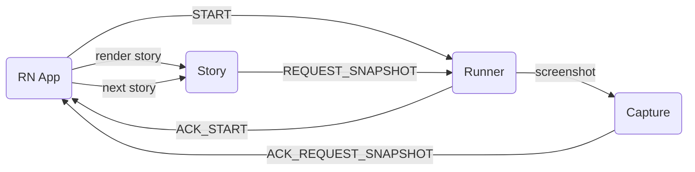

# Storybook Integration

`@sherlo/react-native-storybook` wraps the user's Storybook to enable automated screenshot capture.

## How It Works

The package provides `getStorybook()` which wraps the user's Storybook component. When Sherlo runner launches the app in testing mode, the integration:

1. Discovers all stories from the Storybook registry
2. Communicates with the runner via file-based protocol
3. Renders stories one by one for screenshot capture
4. Collects view hierarchy metadata for the inspector feature

## Exports

| Export | Purpose |
|--------|---------|
| `getStorybook()` | Wraps Storybook for Sherlo testing |
| `isRunningVisualTests()` | Check if app is in Sherlo testing mode |
| `isStorybookMode()` | Check if Storybook UI should be shown |
| `openStorybook()` | Programmatically open Storybook |
| `addStorybookToDevMenu()` | Add Storybook toggle to RN dev menu |

## Testing Mode Architecture

When the runner launches the app:

1. **SherloModule** native module detects testing mode via launch config
2. **TestingMode** component replaces normal Storybook UI
3. **useTestAllStories** hook drives the capture loop:
   - Reads story list from Storybook
   - Writes START protocol message with all available snapshots
   - Waits for ACK_START from runner (which stories to test)
   - Iterates through stories: render → wait for stability → write REQUEST_SNAPSHOT
   - Waits for ACK_REQUEST_SNAPSHOT → moves to next story
4. **MetadataProvider** collects React Fiber metadata for view hierarchy inspection

## Protocol (App Side)

Communication via `protocol.sherlo` file (JSON lines, not WebSocket):

### App → Runner Messages

| Message | Fields | When |
|---------|--------|------|
| START | `snapshots[]` (all stories) | App ready, stories discovered |
| REQUEST_SNAPSHOT | `snapshotIndex`, `inspectorData`, `isStable`, `isScrollableSnapshot`, `scrollOffset`, `safeAreaMetadata` | Story rendered, ready for capture |
| NATIVE_ERROR | `errorCode`, `error` | App crash or init failure |

### Runner → App Messages

| Message | Fields | When |
|---------|--------|------|
| ACK_START | `filteredViewIds[]`, `nextSnapshotIndex`, `nextSnapshot` | Runner confirms, sends first story |
| ACK_REQUEST_SNAPSHOT | `nextSnapshotIndex`, `nextSnapshot` | Screenshot captured, next story |
| ACK_SCROLL_REQUEST | `scrollIndex`, `offsetPx` | Scroll captured, continue scrolling |

**Legend:** RN App = React Native app with Sherlo integration, Runner = sherlo-runner, Story = rendered Storybook story, Capture = screenshot capture

## Story Discovery

Stories are discovered from Storybook's internal registry. The integration supports:
- Storybook 7+ component stories format (CSF)
- Story parameters for Sherlo-specific config (theme, noSafeArea)
- `useSherloEffect` hook for pre-capture setup (data loading, state preparation)

## Scrollable Screenshots

For components taller than the viewport:
1. App sends `isScrollableSnapshot: true` with `scrollOffset`
2. Runner responds with `ACK_SCROLL_REQUEST` + next scroll position
3. App scrolls and sends another `REQUEST_SNAPSHOT`
4. Process repeats until `isAtEnd: true`
5. Runner stitches parts using Dynamic Middle Cut algorithm
