# Sherlo Example - EAS Cloud Build

Minimal React Native + Storybook app with:

- Sherlo integration
- GitHub Actions workflow

<br />

## 🔄 Workflow

Automatically run visual tests **after builds complete on Expo servers**

```mermaid
flowchart TB
   UI(🧑‍💻 Code Changes)
   StartSherlo(⏳ Start Sherlo · Waiting)
   subgraph Cloud[☁️ Build on Expo Servers]
      Android(🤖 Build Android)
      iOS(🍎 Build iOS)
      Android ~~~ iOS
   end
   Test(🧪 Run Test)
   Review(👀 Review Results)

   UI --> StartSherlo
   StartSherlo --> Cloud
   Cloud --> Test
   Test --> Review
```



<br />

## 🛠️ Prerequisites

- [**Sherlo Account**](https://app.sherlo.io) – Required for visual testing
- [**Expo Account**](https://expo.dev/signup) – Required for EAS

<br />

## ⚙️ Setup

### 1. Clone and Install

```bash
# Clone this example
npx degit https://github.com/sherlo-io/sherlo/examples/eas-cloud-build sherlo-eas-cloud-build

# Install dependencies
cd sherlo-eas-cloud-build
yarn install
```

### 2. Configure EAS (Expo)

Set up EAS to build your app binaries

```bash
# Link project to your Expo account
npx eas-cli init
```

### 3. Get Sherlo Token

This token authenticates your account and links tests to your project

1. Go to https://app.sherlo.io
2. Get your token:
   - **New project**: Create a project and copy the token
   - **Existing project**: Reset the token _(Settings → Reset token)_

<br />

## 🚀 How to Run

### Option A: GitHub Actions _(Recommended)_

1. **Create GitHub repository**

   Set up an [empty GitHub repository](https://github.com/new) _(no README or other files)_ and connect it to your project:

   ```bash
   # Link project to your GitHub repository
   git init
   git branch -M main
   git remote add origin https://github.com/YOUR_USERNAME/YOUR_REPO.git
   ```

2. **Add repository secrets**

   In your GitHub repository, go to **Settings → Secrets and variables → Actions → New repository secret** and add:
   - `SHERLO_TOKEN` – Your Sherlo project token
   - `EXPO_TOKEN` – Your [Expo access token](https://expo.dev/accounts/[your-account]/settings/access-tokens)

3. **Trigger the workflow**

   Push to the `main` branch to trigger the automated testing process:

   ```bash
   git add .
   git commit -m "Run Sherlo test"
   git push -u origin main
   ```

   _After pushing, view workflow progress in your repository's **Actions** tab._

---

### Option B: Run Locally

#### Run test

Run Sherlo to trigger builds on Expo servers and visually test them:

```bash
yarn sherlo --token YOUR_SHERLO_TOKEN
# Or add token to sherlo.config.json and run: yarn sherlo
```

_💡 Sherlo injects test metadata before triggering builds. When builds complete, Expo automatically sends them to Sherlo via `eas-build-on-complete` script, and tests run automatically._

_💡 Sherlo injects metadata, triggers builds, and receives completed builds from Expo via `eas-build-on-complete` script_

_💡 Sherlo injects metadata before builds. Expo sends completed builds back via `eas-build-on-complete` and tests run automatically_

_💡 Sherlo injects test metadata, triggers Expo builds, and automatically tests them when complete (via `eas-build-on-complete`)_

_💡 Sherlo injects metadata (authentication token and test ID) so Expo knows where to send completed builds via eas-build-on-complete script_

_💡 Sherlo adds metadata (token + test ID) before triggering builds. Expo uses this to send completed builds back via eas-build-on-complete_

_💡 Sherlo injects metadata (auth token and test ID) needed for Expo to route completed builds back via eas-build-on-complete_

<br />

## 👀 Review Results

Once your test completes, open [Sherlo app](https://app.sherlo.io):

- **First test** _(baseline)_ – Approve correct screenshots – they become your baseline for future comparisons
- **Next tests** _(comparison)_ – Review visual changes

_💡 First test won't show "changes" since there's nothing to compare against yet_

<br />

## 📁 Key Files

- **[`App.tsx`](./App.tsx)** – Root component rendering Storybook for testing _([docs](https://sherlo.io/docs/setup#storybook-access))_
- **[`.rnstorybook/index.ts`](./.rnstorybook/index.ts)** – Storybook component modified for Sherlo integration _([docs](https://sherlo.io/docs/setup#storybook-component))_
- **[`sherlo.config.json`](./sherlo.config.json)** – Config file with testing devices _([docs](https://sherlo.io/docs/config))_
- **[`.github/workflows/eas-cloud-build.yml`](./.github/workflows/eas-cloud-build.yml)** – CI workflow for automated testing process
- **[`package.json`](./package.json)** – Dependencies and scripts for Sherlo integration

_**Own project?** Run `npx sherlo init` to automatically integrate Sherlo in your codebase_

<br />

## 📚 Learn More

To learn more about **EAS Cloud Build** testing method, visit our [documentation](https://sherlo.io/docs/testing?method=eas-cloud-build#testing-methods)

<br />

## 🔗 Other Examples

- **[Standard](../standard)** – Run visual tests on app builds **with bundled JavaScript code**
- **[EAS Update](../eas-update)** – Run visual tests using **Over-The-Air updates** for JavaScript changes, without full app rebuilds
