# EAS Update Example

Minimal React Native + Storybook app with GitHub Actions workflow

Run visual tests using **Over-The-Air updates** for JavaScript changes, without full app rebuilds

<br />

## 🔄 Workflow

```mermaid
flowchart TB
   UI(🧑‍💻 UI Changes)
   Check{Native code changed?}
   Reuse(📦 Reuse Builds)
   subgraph Rebuild[Rebuild Apps]
      Android(🤖 Rebuild Android)
      iOS(🍎 Rebuild iOS)
      Android ~~~ iOS
   end
   Update(🚀 EAS Update)
   Sherlo(🧪 Run Sherlo)
   Review(👀 Review Changes)

   UI --> Check
   Check -->|No| Reuse
   Check -->|Yes| Rebuild
   Reuse & Rebuild --> Update
   Update --> Sherlo
   Sherlo --> Review
```



<br />

## 🛠️ Prerequisites

- [**Sherlo Account**](https://app.sherlo.io) – Required for visual testing
<!--
TODO: Required for EAS Build and EAS Update???
-->
- [**Expo Account**](https://expo.dev/signup) – Required for EAS Build

<br />

## ⚙️ Setup

```bash
# Clone the repository
git clone https://github.com/sherlo-io/sherlo.git

# Navigate to this example
cd sherlo/examples/eas-update

# Install dependencies
yarn install
```

<br />

## 🚀 How to Run

<!-- TODO: Set up EAS (Build and Update)? a moze po prostu "Set up EAS" i wtedy to ujednolicic? -->

### 1) Set up EAS Build

```bash
# Log in with your Expo account
npx eas-cli login

# Link project to your Expo account
npx eas-cli init
```

<!-- TODO: zostawiamy ten komentarz? -->

_This example uses EAS Build. For other build tools, see [docs](https://sherlo.io/docs/builds?type=development-simulator#build-types)_

<!-- TODO: brakuje jeszcze kroku odnoscie setupu EAS Update? jaka to komenda? -->

### 2) Get Sherlo token

Open [Sherlo app](https://app.sherlo.io) and choose one:

- **New project**: Create project and copy the token
- **Existing project**: Reset the token _(Settings → Reset token)_

### 3) Build and run test

#### A) GitHub Actions _(Recommended)_

1.  **Add secrets**: _(GitHub -> [Your Repo] -> Settings → Secrets and variables → Actions -> New repository secret)_
    - `SHERLO_TOKEN` – Your Sherlo project token
    - `EXPO_TOKEN` – Get access token from [Expo](https://expo.dev/accounts/[your-account]/settings/access-tokens)

<!-- TODO: poprawic tekst w nawiasie -->
2.  **Trigger the workflow**

    ```bash
    # Commit and push changes to main branch to trigger the workflow (build + test)
    git add .
    git commit -m "Run first Sherlo test"
    git push origin main
    ```

#### B) Local

1. **Build apps**

   ```bash
   # Build Android
   yarn build:android

   # Build iOS
   yarn build:ios
   ```

<!-- TODO: dodac krok z Update -->

2. **Run test**

   ```bash
   # Run Sherlo
   yarn sherlo --token YOUR_SHERLO_TOKEN
   # Alternatively: add token to sherlo.config.json and run `yarn sherlo`
   ```

### 4) Review results

Open [Sherlo app](https://app.sherlo.io) to view your test results

<br />

## 📁 Key Files

- **[`App.tsx`](./App.tsx)** – Root component rendering Storybook for testing _([docs](https://sherlo.io/docs/setup#storybook-access))_
- **[`.rnstorybook/index.ts`](./.rnstorybook/index.ts)** – Storybook component modified for Sherlo integration _([docs](https://sherlo.io/docs/setup#storybook-component))_
- **[`sherlo.config.json`](./sherlo.config.json)** – Config file with testing devices _([docs](https://sherlo.io/docs/config))_
<!--
TODO: poprawic teskt? moze ujednolicic pomiedzy metodami?
-->
- **[`.github/workflows/eas-update.yml`](./.github/workflows/eas-update.yml)** – CI workflow for automated builds and tests

_**Own project?** Run `npx sherlo init` to automatically integrate Sherlo in your codebase_

<br />

## 🔗 Other Examples

- **[Standard](../standard)** – Run visual tests on app builds **with bundled JavaScript code**
- **[EAS Cloud Build](../eas-cloud-build)** – Automatically run visual tests **after builds complete on Expo servers**
