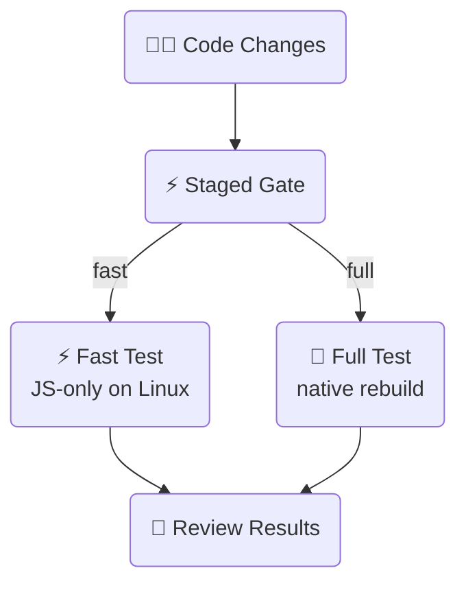

# ⚡ Staged Example • Sherlo

An example showing Sherlo's staged fast path: a single gate routes CI to a
JS-only fast lane on Linux when native inputs are unchanged, and to a full
native build only when they move. Fewer native builds, faster feedback on the
common case.

- Sherlo integration
- GitHub Actions workflow (two-job staged router)

 

## 🔄 Workflow

A gate runs `sherlo staged:check` and routes ONE of two downstream jobs:

The full job's `test:standard` run registers a fresh native base, so the next
push with native unchanged is routed to the fast lane.

 

## 🧭 How routing works

`sherlo staged:check` decides a routing `mode`:

- **`fast`** - native inputs unchanged; reuse the registered base and run
  `test:bundled` (JS-only, on Linux). No native build.
- **`full`** - native inputs moved; do a full native build, then `test:standard`
  (which registers a fresh base).
- **`not-stageable`** - the project can't use the staged path; treated like
  `full`.

The [`staged-gate`](../../actions/staged-gate) action wraps the probe and exposes
`mode` as an output. Jobs route on `needs.gate.outputs.mode`, never on an exit
code - see the action README for how the exit-code trap is handled.

 

## 🛠️ Prerequisites

- [**Sherlo Account**](https://app.sherlo.io) – Required for visual testing
- [**Expo Account**](https://expo.dev/signup) – Required for EAS (native builds)
- Node.js 18+

 

## ⚙️ Setup

Add repository secrets in **Settings → Secrets and variables → Actions**:

- `SHERLO_TOKEN` – Your Sherlo project token
- `EXPO_TOKEN` – Your [Expo access token](https://expo.dev/accounts/[your-account]/settings/access-tokens)

Then push to `main` to trigger the workflow.

 

## 📁 Key Files

- **[`.github/workflows/staged.yml`](./.github/workflows/staged.yml)** – Two-job staged router workflow
- **[`sherlo.config.json`](./sherlo.config.json)** – Devices plus a `staged.fullBuild` block (used by the single-job `--on-stale=build` alternative)
- **[`../../actions/staged-gate`](../../actions/staged-gate)** – The gate action and full docs for both patterns

 

## 🔀 Single-job alternative

Prefer one job? Run `npx sherlo test:bundled --on-stale=build`: fast path when the
base matches, and a config-driven native rebuild plus base-registering full run
when it is stale. See the
[gate action README](../../actions/staged-gate#pattern-b-the-single-job---on-stalebuild-alternative)
for the trade-off (simpler, but no Linux-only fast lane).

 

## 📚 Learn More

To learn more about Sherlo testing methods, visit our
[documentation](https://sherlo.io/docs).

 

## 🔗 Other Examples

- 📦 **[Standard](../standard)** – Test app builds with bundled JavaScript
- ⚡ **[EAS Update](../eas-update)** – Test builds with OTA JavaScript updates - skip rebuilds
- ☁️ **[EAS Cloud Build](../eas-cloud-build)** – Automatically test builds created on Expo servers
