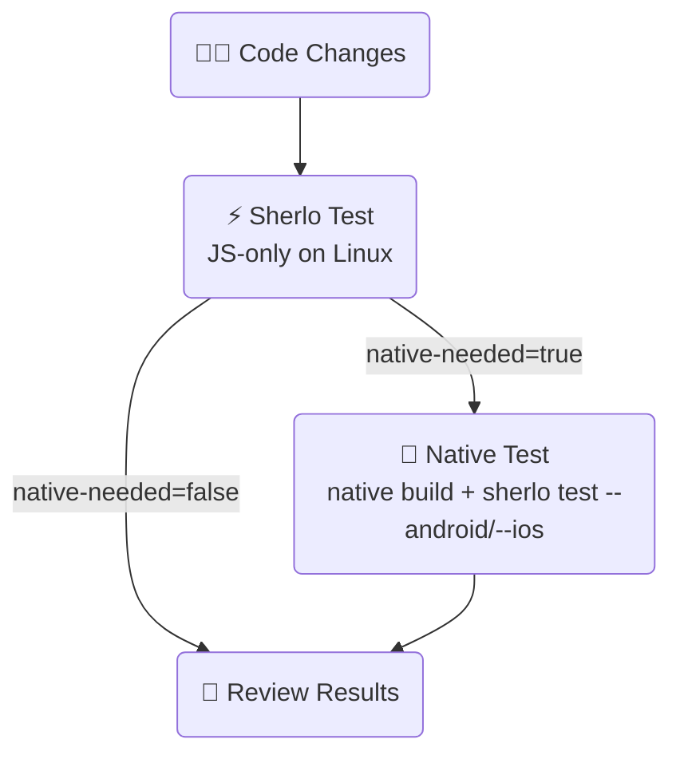

# ⚡ Staged Example • Sherlo

An example showing Sherlo's staged fast path: `sherlo test` runs the test JS-only
on Linux when native inputs are unchanged, and asks for a native build only when
they move. Fewer native builds, faster feedback on the common case.

- Sherlo integration
- GitHub Actions workflow (JS-only first, native build only when asked)

 

## 🔄 Workflow

One job runs `sherlo test`; a second job runs only if it asked for a native build:

The native job's run registers a fresh native base, so the next push with native
unchanged is tested JS-only again.

 

## 🧭 How it works

`sherlo test`, given no build paths, answers one question and publishes it as
`native-needed` (on stdout and in `$GITHUB_OUTPUT`):

- **`native-needed=false`** - native inputs unchanged; a registered base matches
  source. The test **already ran**, JS-only, on the Linux runner. Nothing else to
  do.
- **`native-needed=true`** - native inputs moved, or no base is registered yet.
  **Nothing** was built and no test ran. Build natively, then run the same verb
  with build paths: `sherlo test --android <path> --ios <path>` - which also
  registers the fresh base.

The [`staged-gate`](../../actions/staged-gate) action wraps the first run and
exposes `native-needed` as an output. The follow-up job routes on
`needs.test.outputs.native-needed`, never on an exit code - see the action README
for how the exit code is handled.

 

## 🛠️ Prerequisites

- [**Sherlo Account**](https://app.sherlo.io) – Required for visual testing
- [**Expo Account**](https://expo.dev/signup) – Required for EAS (native builds)
- Node.js 18+

 

## ⚙️ Setup

Add repository secrets in **Settings → Secrets and variables → Actions**:

- `SHERLO_TOKEN` – Your Sherlo project token
- `EXPO_TOKEN` – Your [Expo access token](https://expo.dev/accounts/[your-account]/settings/access-tokens)

Then push to `main` to trigger the workflow.

 

## 📁 Key Files

- **[`.github/workflows/staged.yml`](./.github/workflows/staged.yml)** – JS-only first, native build only when asked
- **[`sherlo.config.json`](./sherlo.config.json)** – Devices to test on
- **[`../../actions/staged-gate`](../../actions/staged-gate)** – The action and full docs, including a single-job variant

 

## 📚 Learn More

To learn more about Sherlo testing methods, visit our
[documentation](https://sherlo.io/docs).

 

## 🔗 Other Examples

- 📦 **[Standard](../standard)** – Test app builds with bundled JavaScript
- ⚡ **[EAS Update](../eas-update)** – Test builds with OTA JavaScript updates - skip rebuilds
- ☁️ **[EAS Cloud Build](../eas-cloud-build)** – Automatically test builds created on Expo servers
