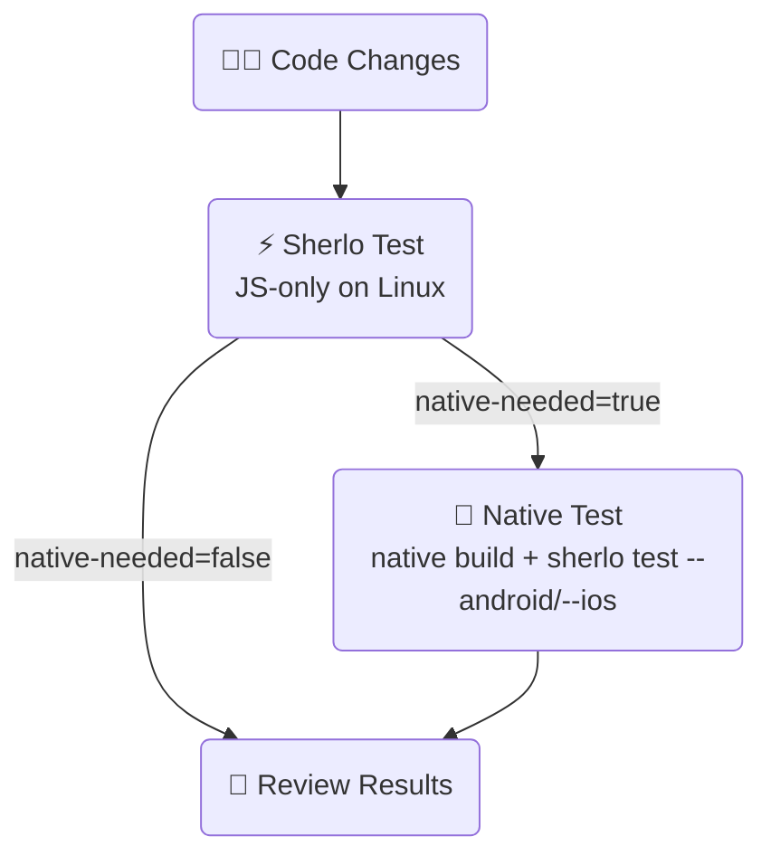

# ⚡ Staged Example • Sherlo

An example showing Sherlo's staged fast path: `sherlo test` runs the test JS-only
on Linux when native inputs are unchanged, and asks for a native build only when
they move. Fewer native builds, faster feedback on the common case.

- Sherlo integration
- GitHub Actions workflow (JS-only first, native build only when asked)

<br />

## 🔄 Workflow

One job runs `sherlo test`; a second job runs only if it asked for a native build:



The native job's run registers a fresh native base, so the next push with native
unchanged is tested JS-only again.

<br />

## 🧭 How it works

`sherlo test`, given no build paths, answers one question and publishes it as
`native-needed`:

- **`native-needed=false`** - native inputs unchanged; a registered base matches
  source. The test **already ran**, JS-only, on the Linux runner. Nothing else to
  do.
- **`native-needed=true`** - native inputs moved, or no base is registered yet.
  **Nothing** was built and no test ran. Build natively, then run the same verb
  with build paths - which also registers the fresh base.

Both jobs use the same action, [`sherlo-io/sherlo`](../../action.yml); the build
paths are what pick the road:

```yaml
# The routing question - no build paths.
- id: sherlo
  uses: sherlo-io/sherlo@v2
  with:
    token: ${{ secrets.SHERLO_TOKEN }}

# The full run that registers a fresh base - build paths given.
- uses: sherlo-io/sherlo@v2
  with:
    token: ${{ secrets.SHERLO_TOKEN }}
    android: android.apk
    ios: ios.tar.gz
```

The follow-up job routes on `needs.test.outputs.native-needed`, never on an exit
code. `sherlo test` exits `4` when a native build is needed - an expected answer,
not a failure - and the action absorbs that: it succeeds on every routing outcome
and fails only when the CLI answered nothing at all (a genuine tool error, such
as a bad token).

### Action inputs and outputs

| Input               | Required | Default              | Description                                          |
| ------------------- | -------- | -------------------- | ---------------------------------------------------- |
| `token`             | yes      | -                    | Sherlo project token (`SHERLO_TOKEN`)                |
| `config`            | no       | `sherlo.config.json` | Path to the Sherlo config file                       |
| `project-root`      | no       | `.`                  | Root directory of the React Native project           |
| `android`           | no       | -                    | Android build (.apk); switches to the full run       |
| `ios`               | no       | -                    | iOS build (.app, .tar.gz, .tar); switches to the full run |
| `working-directory` | no       | `.`                  | Directory to run `sherlo test` in                    |

| Output             | Description                                                                |
| ------------------ | -------------------------------------------------------------------------- |
| `native-needed`    | `true` if a native build is required first, `false` if the run completed     |
| `reason`           | Single-line human explanation of the answer                                |
| `base-fingerprint` | Source base fingerprint the answer was measured against (may be empty)     |
| `url`              | Review URL of the build this run opened (empty when no test ran)           |

<br />

## 🧩 Single-job variant

If you would rather not split jobs, run both steps in one macOS job: the routing
question first, then build natively and re-run with build paths only when the
first step asked for it.

```yaml
jobs:
  test:
    # macOS so the native build can run when it is needed.
    runs-on: macos-latest
    steps:
      - uses: actions/checkout@v6
      - uses: actions/setup-node@v6
        with:
          node-version: 'lts/*'
          cache: 'yarn'
      - uses: expo/expo-github-action@v8
        with:
          eas-version: latest
          token: ${{ secrets.EXPO_TOKEN }}
      - run: yarn install

      - id: sherlo
        uses: sherlo-io/sherlo@v2
        with:
          token: ${{ secrets.SHERLO_TOKEN }}

      - if: steps.sherlo.outputs.native-needed == 'true'
        run: |
          eas build --non-interactive --local --platform android --profile preview-simulator --output android.apk
          eas build --non-interactive --local --platform ios --profile preview-simulator --output ios.tar.gz

      - if: steps.sherlo.outputs.native-needed == 'true'
        uses: sherlo-io/sherlo@v2
        with:
          token: ${{ secrets.SHERLO_TOKEN }}
          android: android.apk
          ios: ios.tar.gz
```

**Trade-off.** The single job is simpler, but it has no Linux-only lane: because
it must be able to run the native build, it runs on macOS even when the base
matches and the run stays JS-only. The two-job pattern keeps the common case on
cheaper Linux runners and only spends a macOS runner when a native build is
actually required.

<br />

## 🛠️ Prerequisites

- [**Sherlo Account**](https://app.sherlo.io) – Required for visual testing
- [**Expo Account**](https://expo.dev/signup) – Required for EAS (native builds)
- Node.js 18+

<br />

## ⚙️ Setup

Add repository secrets in **Settings → Secrets and variables → Actions**:

- `SHERLO_TOKEN` – Your Sherlo project token
- `EXPO_TOKEN` – Your [Expo access token](https://expo.dev/accounts/[your-account]/settings/access-tokens)

Then push to `main` to trigger the workflow.

<br />

## 📁 Key Files

- **[`.github/workflows/staged.yml`](./.github/workflows/staged.yml)** – JS-only first, native build only when asked
- **[`sherlo.config.json`](./sherlo.config.json)** – Devices to test on
- **[`../../action.yml`](../../action.yml)** – The `sherlo-io/sherlo` action both jobs use

<br />

## 📚 Learn More

To learn more about Sherlo testing methods, visit our
[documentation](https://sherlo.io/docs).

<br />

## 🔗 Other Examples

- 📦 **[Standard](../standard)** – Test app builds with bundled JavaScript
- ⚡ **[EAS Update](../eas-update)** – Test builds with OTA JavaScript updates - skip rebuilds
- ☁️ **[EAS Cloud Build](../eas-cloud-build)** – Automatically test builds created on Expo servers
