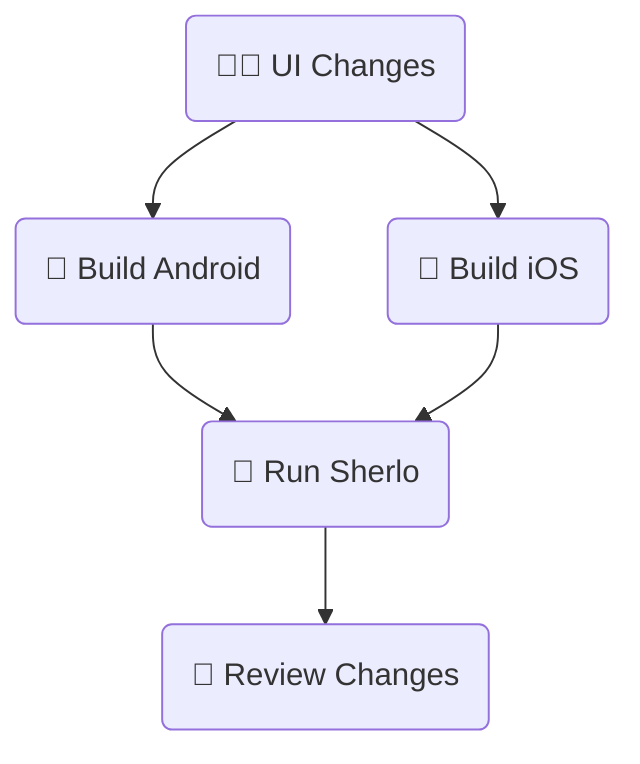
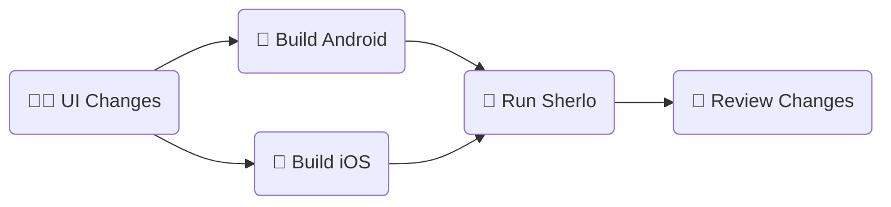

# Standard Example

This workflow runs visual tests on app builds **with bundled JavaScript code.**

It includes a minimal React Native + Storybook setup and a GitHub Actions workflow.

<br />

## 🔄 Workflow Visualization





For implementation details, see [`.github/workflows/standard.yml`](./.github/workflows/standard.yml).

<br />

## 🛠️ Prerequisites

Before getting started, ensure you have:

- A Sherlo account – sign up at https://app.sherlo.io
- An Expo account (for EAS Build) – sign up at https://expo.dev/signup

<br />

## ⚙️ Setup

```bash
# Clone the repository
git clone https://github.com/sherlo-io/sherlo.git

# Navigate to this example
cd sherlo/examples/standard

# Install dependencies
yarn install
```

<br />

## 🚀 How to Run

### via GitHub Actions

1. **Configure EAS:** Run `npx eas-cli login` and `npx eas-cli init` to link the project to your Expo account

2. **Add secrets to your GitHub repo** (Settings → Secrets and variables → Actions):
   - `EXPO_TOKEN` – create at https://expo.dev/accounts/[your-account]/settings/access-tokens
   - `SHERLO_TOKEN` – get from https://app.sherlo.io (create or select a project → Settings)

3. **Trigger the workflow:** Commit and push to `main` branch

4. **Review results:** Check GitHub Actions tab and view results at https://app.sherlo.io

### Locally

1. **Configure EAS:** Run `npx eas-cli login` and `npx eas-cli init` to link the project to your Expo account

2. **Build the apps:** Run `yarn build:android` and `yarn build:ios`

3. **Run test:** Execute `yarn sherlo:test --token [your-token]`
   - Get your token at https://app.sherlo.io (create or select a project → Settings)
   - Alternatively, add the token to `sherlo.config.json` ([docs](https://sherlo.io/docs/config#token))

4. **Review results:** View results at https://app.sherlo.io

<br />

## 📁 Key Project Files

This example includes several important files configured for Sherlo integration:

- **[`App.tsx`](./App.tsx)** – Main component that renders Storybook for testing
- **[`.rnstorybook/index.ts`](./.rnstorybook/index.ts)** – Exports the Storybook component required by Sherlo ([setup docs](https://sherlo.io/docs/setup#storybook-component))
- **[`sherlo.config.json`](./sherlo.config.json)** – Configuration file with device settings, and optionally build paths or token
- **[`.github/workflows/standard.yml`](./.github/workflows/standard.yml)** – GitHub Actions workflow that automates the build and test process

💡 **Using Sherlo in your own project?** Run `npx sherlo init` to automatically create and configure these files.

<br />

## 🔗 Other Examples

- **[EAS Update](../eas-update)** – Run visual tests using Over-The-Air updates for JavaScript changes, without full app rebuilds
- **[EAS Cloud Build](../eas-cloud-build)** – Automatically run visual tests after builds complete on Expo servers

---

**Alternative build tools:** This example uses EAS Build. For React Native CLI or native tools (gradlew/xcodebuild), see [build documentation](https://sherlo.io/docs/builds?type=preview-simulator#build-types).
