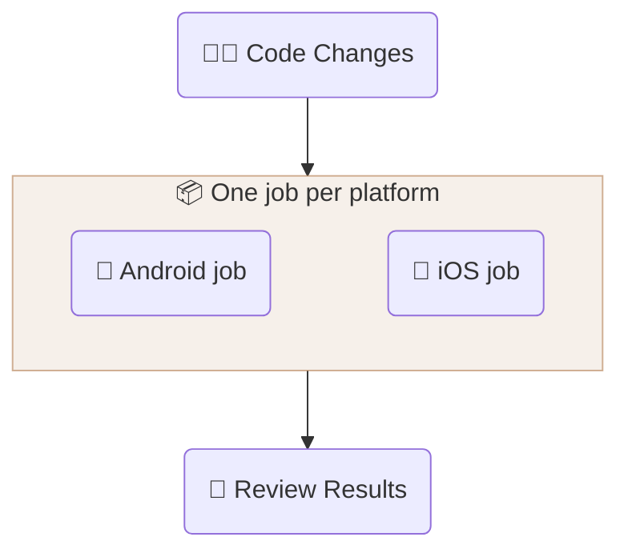

# 📦 Standard Example • Sherlo

A minimal example app showing Sherlo running automated [visual regression testing for React Native](https://sherlo.io). Sherlo captures Storybook stories on iOS and Android simulators in the cloud. `npx sherlo test` builds the iOS and Android apps itself, with Gradle and Xcode, then uploads them and tests every story.

- Sherlo integration
- GitHub Actions workflow

<br />

## 🔄 Workflow

CI runs one job per platform with the Sherlo GitHub Action. The two jobs share one test.


```mermaid
flowchart TB
   UI(🧑‍💻 Code Changes)
   subgraph Jobs[📦 One job per platform]
      Android(🤖 Android job)
      iOS(🍎 iOS job)
      Android ~~~ iOS
      style Jobs fill:#b8885f21,stroke:#b8885fa6
   end
   Review(👀 Review Results)

   UI --> Jobs
   Jobs --> Review
```

<br />

## 🛠️ Prerequisites

- [**Sherlo Account**](https://app.sherlo.io) – Required for visual testing
- Node.js 18+

<br />

## ⚙️ Setup

### 1. Clone and Install

```bash
# Clone this example
npx degit https://github.com/sherlo-io/sherlo/examples/standard sherlo-standard

# Install dependencies
cd sherlo-standard
yarn install
```

### 2. Log in to Sherlo

Log in once with `npx sherlo login`. In CI, the project token is passed as the `SHERLO_TOKEN` secret.

To get a project token:

1. Go to https://app.sherlo.io
2. Get your token:
   - **New project**: Create a project and copy the token
   - **Existing project**: Reset the token _(Settings → Reset token)_

<br />

## 🚀 How to Run

### Option A: Run from Terminal

Run Sherlo visual test. It builds the iOS and Android apps itself, uploads them and tests every story:

```bash
yarn sherlo
```

---

### Option B: GitHub Actions

1. **Create GitHub repository**

   Set up an [empty GitHub repository](https://github.com/new) _(no README or other files)_ and connect it to your project:

   ```bash
   # Link project to your GitHub repository
   git init
   git branch -M main
   git remote add origin https://github.com/YOUR_USERNAME/YOUR_REPO.git
   ```

2. **Add repository secrets**

   In your GitHub repository, go to **Settings → Secrets and variables → Actions → New repository secret** and add:

   - `SHERLO_TOKEN` – Your Sherlo project token

3. **Trigger the workflow**

   Push to the `main` branch to trigger the automated testing process:

   ```bash
   git add .
   git commit -m "Run Sherlo test"
   git push -u origin main
   ```

   _💡 After pushing, view workflow progress in your repository's Actions tab_

<br />

## 👀 Review Results

Once your test completes, open [Sherlo app](https://app.sherlo.io):

- **First test** _(baseline)_ – Approve correct screenshots - they become your baseline for future comparisons
- **Next tests** _(comparison)_ – Review visual changes - confirm what’s expected or needs fixing

_💡 First test won't show "changes" since there's nothing to compare against yet_

<br />

## 📁 Key Files

- **[`App.tsx`](./App.tsx)** – Root component rendering Storybook for testing _([docs](https://sherlo.io/docs/setup#storybook-access))_
- **[`metro.config.js`](./metro.config.js)** – Metro config wrapped with Sherlo's `withStorybook` _([docs](https://sherlo.io/docs/setup#metro-config))_
- **[`sherlo.config.json`](./sherlo.config.json)** – Config file with testing devices _([docs](https://sherlo.io/docs/config))_
- **[`.github/workflows/standard.yml`](./.github/workflows/standard.yml)** – CI workflow for automated testing process
- **[`package.json`](./package.json)** – Dependencies and scripts for Sherlo integration

_💡 **Own project?** Run `npx sherlo init` to automatically integrate Sherlo in your codebase_

<br />

## 📚 Learn More

To learn more about testing with Sherlo, visit our [documentation](https://sherlo.io/docs/testing)

<br />

## 🔗 Other Examples

- ☁️ **[EAS Cloud Build](../eas-cloud-build)** – Automatically test builds created on Expo servers
