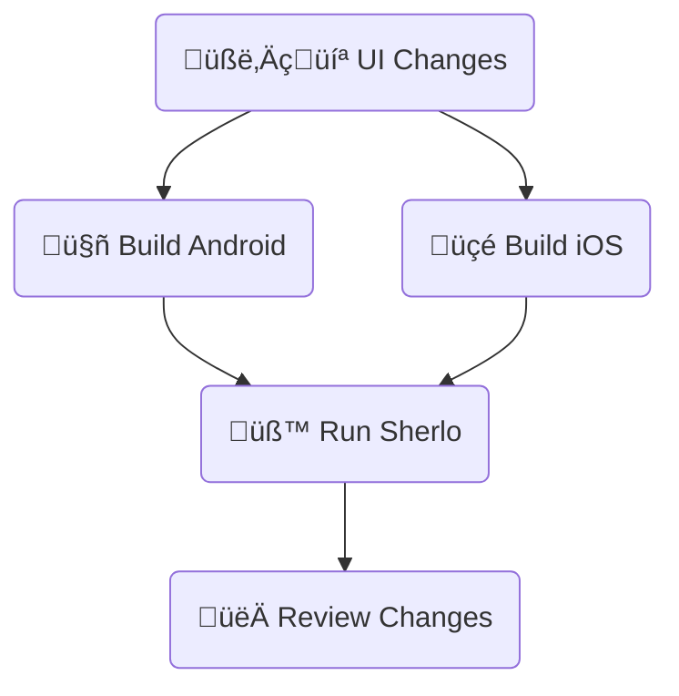

# Standard Example

Minimal React Native + Storybook setup with GitHub Actions workflow

Run visual tests on app builds **with bundled JavaScript code**

<br />

## 🔄 Workflow



<br />

## 🛠️ Prerequisites

- [**Sherlo Account**](https://app.sherlo.io) – Required for visual testing
- [**Expo Account**](https://expo.dev/signup) – Required for EAS Build

_**Build Method:** This example uses EAS Build. For other build tools, see [documentation](https://sherlo.io/docs/builds?type=preview-simulator#build-types)_

<br />

## ⚙️ Setup

```bash
# Clone the repository
git clone https://github.com/sherlo-io/sherlo.git

# Navigate to this example
cd sherlo/examples/standard

# Install dependencies
yarn install
```

<br />

## 🚀 How to Run

### 1) Configure EAS

```bash
# Log in to EAS
npx eas-cli login

# Link project to your Expo account
npx eas-cli init
```

### 1) Configure EAS Build

```bash
# Log in to EAS
npx eas-cli login

# Link project to your Expo account
npx eas-cli init
```

### 1) Link project to Expo

```bash
# Log in to EAS
npx eas-cli login

# Link project to your Expo account
npx eas-cli init
```

### 1) Link Expo project _(for EAS Build)_

```bash
# Log in to EAS
npx eas-cli login

# Link project to your Expo account
npx eas-cli init
```

### 1) Link EAS _(Required for EAS Build)_

```bash
# Log in to EAS
npx eas-cli login

# Link project to your Expo account
npx eas-cli init
```

### 1) Enable EAS Build

```bash
# Log in to EAS
npx eas-cli login

# Link project to your Expo account
npx eas-cli init
```

<br />

### 2) Get Sherlo token

1. Go to [Sherlo app](https://app.sherlo.io)
2. Choose one:
   - **New project**: Create a new project and copy the generated token
   - **Existing project**: Open your project and reset the token _(Settings → Reset token)_

<br />

### 3) Build and run test

#### Option A: GitHub Actions _(Recommended)_

1.  **Add secrets**: _(GitHub -> [Your Repo] -> Settings → Secrets and variables → Actions -> New repository secret)_
    - `SHERLO_TOKEN` – Use your Sherlo project token
    - `EXPO_TOKEN` – Get access token from [Expo](https://expo.dev/accounts/[your-account]/settings/access-tokens)

2.  **Trigger the workflow**

    ```bash
    # Commit and push changes to main branch to trigger the workflow (build + test)
    git add .
    git commit -m "First Sherlo Test"
    git push origin main
    ```

#### Option B: Local environment

1. **Build apps**

   ```bash
   # Build Android
   yarn build:android

   # Build iOS
   yarn build:ios
   ```

2. **Run test**

   ```bash
   # Run Sherlo test with your project token
   yarn sherlo --token [SHERLO_TOKEN]
   # (or add the token to `sherlo.config.json` and simply run `yarn sherlo`)
   ```

<br />

### 4) Review results

View results in Sherlo web application at https://app.sherlo.io

<br />

## 📁 Key Files

- **[`App.tsx`](./App.tsx)** – Root component rendering Storybook for testing _([docs](https://sherlo.io/docs/setup#storybook-access))_
- **[`.rnstorybook/index.ts`](./.rnstorybook/index.ts)** – Modified Storybook component required by Sherlo _([docs](https://sherlo.io/docs/setup#storybook-component))_
- **[`sherlo.config.json`](./sherlo.config.json)** – Config file with testing devices _([docs](https://sherlo.io/docs/config))_
- **[`.github/workflows/standard.yml`](./.github/workflows/standard.yml)** – CI workflow for automated builds and tests

_**Own project?** Run `npx sherlo init` to automatically integrate Sherlo in your codebase_

<br />

## 🔗 Other Examples

- **[EAS Update](../eas-update)** – Run visual tests using **Over-The-Air updates** for JavaScript changes, without full app rebuilds
- **[EAS Cloud Build](../eas-cloud-build)** – Automatically run visual tests **after builds complete on Expo servers**
