# 📦 Standard Example • Sherlo

Minimal React Native + Storybook app with:

- Sherlo integration
- GitHub Actions workflow

<br />

## 🔄 Workflow

Run visual tests on app builds with **bundled JavaScript**

```mermaid
flowchart TB
   UI(🧑‍💻 Code Changes)
   subgraph Build[📦 Create Builds]
      Android(🤖 Build Android)
      iOS(🍎 Build iOS)
      Android ~~~ iOS
      style Build fill:#b8885f21,stroke:#b8885fa6
   end
   Test(🧪 Run Test)
   Review(👀 Review Results)

   UI --> Build
   Build --> Test
   Test --> Review
```



<br />

## 🛠️ Prerequisites

- [**Sherlo Account**](https://app.sherlo.io) – Required for visual testing
- [**Expo Account**](https://expo.dev/signup) – Required for EAS
- Node.js 18+

<br />

## ⚙️ Setup

### 1. Clone and Install

```bash
# Clone this example
npx degit https://github.com/sherlo-io/sherlo/examples/standard sherlo-standard

# Install dependencies
cd sherlo-standard
yarn install
```

### 2. Configure EAS (Expo)

Set up EAS to build your app binaries:

```bash
# Link project to your Expo account
npx eas-cli init
```

_💡 This example uses EAS Build; for other build tools, see our [documentation](https://sherlo.io/docs/builds?type=preview-simulator#build-types)_

### 3. Get Sherlo Token

This token authenticates your account and links tests to your project

1. Go to https://app.sherlo.io
2. Get your token:
   - **New project**: Create a project and copy the token
   - **Existing project**: Reset the token _(Settings → Reset token)_

<br />

## 🚀 How to Run

### Option A: Run from Terminal

1. **Create preview simulator builds**

   Create Android and iOS builds with bundled JavaScript:

   ```bash
   yarn build:android
   yarn build:ios
   ```

2. **Run test**

   Run Sherlo visual test:

   ```bash
   yarn sherlo --token YOUR_SHERLO_TOKEN
   # Or add token to sherlo.config.json and run `yarn sherlo`
   ```

---

### Option B: GitHub Actions

1. **Create GitHub repository**

   Set up an [empty GitHub repository](https://github.com/new) _(no README or other files)_ and connect it to your project:

   ```bash
   # Link project to your GitHub repository
   git init
   git branch -M main
   git remote add origin https://github.com/YOUR_USERNAME/YOUR_REPO.git
   ```

2. **Add repository secrets**

   In your GitHub repository, go to **Settings → Secrets and variables → Actions → New repository secret** and add:
   - `SHERLO_TOKEN` – Your Sherlo project token
   - `EXPO_TOKEN` – Your [Expo access token](https://expo.dev/accounts/[your-account]/settings/access-tokens)

3. **Trigger the workflow**

   Push to the `main` branch to trigger the automated testing process:

   ```bash
   git add .
   git commit -m "Run Sherlo test"
   git push -u origin main
   ```

   _💡 After pushing, view workflow progress in your repository's Actions tab_

<br />

## 👀 Review Results

Once your test completes, open [Sherlo app](https://app.sherlo.io):

- **First test** _(baseline)_ – Approve correct screenshots - they become your baseline for future comparisons
- **Next tests** _(comparison)_ – Review visual changes - confirm what’s expected or needs fixing

_💡 First test won't show "changes" since there's nothing to compare against yet_

<br />

## 📁 Key Files

- **[`App.tsx`](./App.tsx)** – Root component rendering Storybook for testing _([docs](https://sherlo.io/docs/setup#storybook-access))_
- **[`.rnstorybook/index.ts`](./.rnstorybook/index.ts)** – Storybook component modified for Sherlo integration _([docs](https://sherlo.io/docs/setup#storybook-component))_
- **[`sherlo.config.json`](./sherlo.config.json)** – Config file with testing devices _([docs](https://sherlo.io/docs/config))_
- **[`.github/workflows/standard.yml`](./.github/workflows/standard.yml)** – CI workflow for automated testing process
- **[`package.json`](./package.json)** – Dependencies and scripts for Sherlo integration

_💡 **Own project?** Run `npx sherlo init` to automatically integrate Sherlo in your codebase_

<br />

## 📚 Learn More

To learn more about **Standard** testing method, visit our [documentation](https://sherlo.io/docs/testing?method=standard#testing-methods)

<br />

## 🔗 Other Examples

- ⚡ **[EAS Update](../eas-update)** – Test builds with OTA JavaScript updates - skip rebuilds
- ☁️ **[EAS Cloud Build](../eas-cloud-build)** – Automatically test builds created on Expo servers
