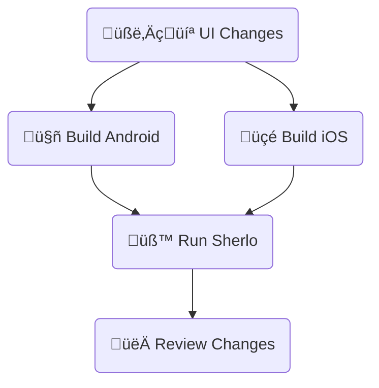

# Standard Example

Minimal React Native + Storybook setup with GitHub Actions workflow.

Run visual tests on app builds **with bundled JavaScript code**.

<br />

## 🔄 Workflow



<br />

## 🛠️ Prerequisites

- **Sherlo Account** – required for visual testing ([sign up](https://app.sherlo.io))
- **Expo Account** – required for EAS Build ([sign up](https://expo.dev/signup))

_**Build Method:** This example uses EAS Build. For other build tools, see [documentation](https://sherlo.io/docs/builds?type=preview-simulator#build-types)._

<br />

## ⚙️ Setup

```bash
# Clone the repository
git clone https://github.com/sherlo-io/sherlo.git

# Navigate to this example
cd sherlo/examples/standard

# Install dependencies
yarn install
```

<br />

## 🚀 How to Run

### 1) Configure EAS

```bash
# Log in to EAS
npx eas-cli login

# Link project to your Expo account
npx eas-cli init
```

<br />

### 2) Choose your workflow

#### A) GitHub Actions _([`.github/workflows/standard.yml`](./.github/workflows/standard.yml))_

<!-- 1. **Add secrets** (Settings → Secrets and variables → Actions -> New repository secret):
   - `EXPO_TOKEN` – [create here](https://expo.dev/accounts/[your-account]/settings/access-tokens)
   - `SHERLO_TOKEN` – from [Sherlo](https://app.sherlo.io) (Project → Settings)

2. **Trigger:** Commit and push to `main` branch -->

1. **Add secrets**: _(Settings → Secrets and variables → Actions -> New repository secret)_
   - `EXPO_TOKEN` – Go to https://expo.dev/accounts/[your-account]/settings/access-tokens, create and copy a token, then add as secret
   - `EXPO_TOKEN` – [create here](https://expo.dev/accounts/[your-account]/settings/access-tokens)
   - `SHERLO_TOKEN` – from [Sherlo](https://app.sherlo.io) (Project → Settings)

2. **Trigger the workflow**

```bash
# Commit and push changes to main branch to trigger the workflow (build + test)
git add .
git commit -m "First Sherlo Test"
git push origin main
```

#### B) Local

<!-- 1. **Build:** Run `yarn build:android` and `yarn build:ios`

2. **Test:** Run `yarn sherlo:test --token [SHERLO_TOKEN]`
   - Get token from [Sherlo](https://app.sherlo.io) (Project → Settings)
   - Or add it to `sherlo.config.json` ([docs](https://sherlo.io/docs/config#token)) -->

1. **Build apps**

```bash
# Build Android
yarn build:android

# Build iOS
yarn build:ios
```

2. **Run test**

```bash
# Run Sherlo test with your project token
yarn sherlo:test --token [SHERLO_TOKEN]
```

<br />

### 3) Review results

View results in Sherlo web application at https://app.sherlo.io.

<br />

## 📁 Key Files

- **[`App.tsx`](./App.tsx)** – Root component rendering Storybook for testing ([docs](https://sherlo.io/docs/setup#storybook-access))
- **[`.rnstorybook/index.ts`](./.rnstorybook/index.ts)** – Modified Storybook component required by Sherlo ([docs](https://sherlo.io/docs/setup#storybook-component))
- **[`sherlo.config.json`](./sherlo.config.json)** – Config file with testing devices ([docs](https://sherlo.io/docs/config))
- **[`.github/workflows/standard.yml`](./.github/workflows/standard.yml)** – CI workflow for automated builds and tests

_**Own project?** Run `npx sherlo init` to automatically integrate Sherlo in your codebase._

<br />

## 🔗 Other Examples

- **[EAS Update](../eas-update)** – Run visual tests using **Over-The-Air updates** for JavaScript changes, without full app rebuilds
- **[EAS Cloud Build](../eas-cloud-build)** – Automatically run visual tests **after builds complete on Expo servers**
