# Sherlo Example - Standard

Minimal React Native + Storybook app with GitHub Actions workflow

Run visual tests on app builds **with bundled JavaScript code**

<br />

## 🔄 Workflow

```mermaid
flowchart TB
   UI(🧑‍💻 Code Changes)
   subgraph Build[Build Apps]
      Android(🤖 Build Android)
      iOS(🍎 Build iOS)
      Android ~~~ iOS
   end
   Sherlo(🧪 Run Sherlo)
   Review(👀 Review Results)

   UI --> Build
   Build --> Sherlo
   Sherlo --> Review
```



<br />

## 🛠️ Prerequisites

- [**Sherlo Account**](https://app.sherlo.io) – Required for visual testing
- [**Expo Account**](https://expo.dev/signup) – Required for EAS Build

<br />

## ⚙️ Setup

### 1. Clone and Install

```bash
# Clone this example
npx degit https://github.com/sherlo-io/sherlo/examples/standard sherlo-standard

# Install dependencies
cd sherlo-standard
yarn install
```

### 2. Configure EAS (Expo)

<!-- This example uses EAS Build. For other build tools, check our [documentation](https://sherlo.io/docs/builds?type=preview-simulator#build-types)

This example uses EAS Build; see [docs](https://sherlo.io/docs/builds?type=preview-simulator#build-types) for alternatives -->

Set up EAS to build your apps. This example uses EAS Build - for other tools, see our [documentation](https://sherlo.io/docs/builds?type=preview-simulator#build-types)

```bash
# Link project to your Expo account
npx eas-cli login
npx eas-cli init

# Configure EAS Update for Over-The-Air updates
npx eas-cli update:configure
```

### 3. Get Sherlo Token

This token authenticates your account and links test runs to your project

1. Go to https://app.sherlo.io
2. Get your token:
   - **New project**: Create project and copy the token
   - **Existing project**: Reset the token _(Settings → Reset token)_

<br />

## 🚀 How to Run

### Option A: GitHub Actions _(Recommended)_ 🚀

1. **Create GitHub repository**

   Set up an [empty GitHub repository](https://github.com/new) _(no README or other files)_ and connect it to your project:
   
   ```bash
   # Initialize Git and link the project to your GitHub repository
   git init
   git branch -M main
   git remote add origin https://github.com/YOUR_USERNAME/YOUR_REPO.git
   ```

2. **Add repository secrets**
   
   In your GitHub repository, go to **Settings → Secrets and variables → Actions → New repository secret** and add:
   - `SHERLO_TOKEN` – Your Sherlo project token
   - `EXPO_TOKEN` – Your [Expo access token](https://expo.dev/accounts/[your-account]/settings/access-tokens)

3. **Trigger the workflow**

   Push your code to the `main` branch to trigger the GitHub Actions workflow:
   
   ```bash
   git add .
   git commit -m "Run first Sherlo test"
   git push -u origin main
   ```

---

### Option B: Run Locally 💻

1. **Build apps**

   Build Android and iOS apps on your machine:

   ```bash
   yarn build:android
   yarn build:ios
   ```

3. **Run test**

   Run Sherlo visual test on the built apps:

   ```bash
   yarn sherlo --token YOUR_SHERLO_TOKEN
   # Or add token to sherlo.config.json and run: `yarn sherlo`
   ```

<br />

## 👀 Review Results

Once your test completes, open [Sherlo app](https://app.sherlo.io) to review visual changes

<br />

## 📁 Key Files

- **[`App.tsx`](./App.tsx)** – Root component rendering Storybook for testing _([docs](https://sherlo.io/docs/setup#storybook-access))_
- **[`.rnstorybook/index.ts`](./.rnstorybook/index.ts)** – Storybook component modified for Sherlo integration _([docs](https://sherlo.io/docs/setup#storybook-component))_
- **[`sherlo.config.json`](./sherlo.config.json)** – Config file with testing devices _([docs](https://sherlo.io/docs/config))_
- **[`.github/workflows/standard.yml`](./.github/workflows/standard.yml)** – CI workflow for automated builds and tests

_**Own project?** Run `npx sherlo init` to automatically integrate Sherlo in your codebase_

<br />

## 🔗 Other Examples

- **[EAS Update](../eas-update)** – Run visual tests using **Over-The-Air updates** for JavaScript changes, without full app rebuilds
- **[EAS Cloud Build](../eas-cloud-build)** – Automatically run visual tests **after builds complete on Expo servers**
