# Sherlo Example - Standard

Minimal React Native + Storybook app with GitHub Actions workflow

Run visual tests on app builds **with bundled JavaScript code**

<br />

## 🔄 Workflow

```mermaid
flowchart TB
   UI(🧑‍💻 UI Changes)
   subgraph Build[Build Apps]
      Android(🤖 Build Android)
      iOS(🍎 Build iOS)
      Android ~~~ iOS
   end
   Sherlo(🧪 Run Sherlo)
   Review(👀 Review Results)

   UI --> Build
   Build --> Sherlo
   Sherlo --> Review
```



<br />

## 🛠️ Prerequisites

- [**Sherlo Account**](https://app.sherlo.io) – Required for visual testing
- [**Expo Account**](https://expo.dev/signup) – Required for EAS Build

<br />

## ⚙️ Setup

### 1. Clone and Install

```bash
# Clone this example
npx degit https://github.com/sherlo-io/sherlo/examples/standard sherlo-standard

# Install dependencies
cd sherlo-standard
yarn install
```

### 2. Configure EAS (Expo)

```bash
# Link project to your Expo account
npx eas-cli login
npx eas-cli init

# Configure EAS Update for over-the-air updates
npx eas-cli update:configure
```

_This example uses EAS Build. For other build tools, see [docs](https://sherlo.io/docs/builds?type=preview-simulator#build-types)_

### 3. Get Sherlo Token

1. Go to https://app.sherlo.io
2. Choose one:
   - **New project**: Create project and copy the token
   - **Existing project**: Reset the token _(Settings → Reset token)_

<!-- _You will use this token when running Sherlo tests_ -->


<br />

## 🚀 How to Run

<!-- ### 1) Set up EAS Build

```bash
# Log in with your Expo account
npx eas-cli login

# Link project to your Expo account
npx eas-cli init

# Configure EAS Update for over-the-air updates
npx eas-cli update:configure
```

_This example uses EAS Build. For other build tools, see [docs](https://sherlo.io/docs/builds?type=preview-simulator#build-types)_

### 2) Get Sherlo token

Open [Sherlo app](https://app.sherlo.io) and choose one:

- **New project**: Create project and copy the token
- **Existing project**: Reset the token _(Settings → Reset token)_

### 3) Build and run test

#### WERSJA 1 -->

<!-- ### A) GitHub Actions _(Recommended)_

1. **Create GitHub repository**

   Go to [GitHub](https://github.com/new) and create a new repository
   
   ```bash
   # Initialize git and link to your repository
   git init
   git remote add origin https://github.com/YOUR_USERNAME/YOUR_REPO.git
   ```

2. **Configure repository secrets**

   Go to your repository → Settings → Secrets and variables → Actions → New repository secret

   Add these secrets:
   - `SHERLO_TOKEN` – Your Sherlo project token
   - `EXPO_TOKEN` – Get access token from [Expo](https://expo.dev/accounts/[your-account]/settings/access-tokens)

3. **Push code to trigger workflow**

   ```bash
   # Push changes to main branch to trigger the workflow (build + test)
   git add .
   git commit -m "Run first Sherlo test"
   git push -u origin main
   ```

---

#### WERSJA 2

#### A) GitHub Actions _(Recommended)_

1. **Create repository and link project**

   [Create new repository on GitHub](https://github.com/new), then link your local project:
   
   ```bash
   git init
   git remote add origin https://github.com/YOUR_USERNAME/YOUR_REPO.git
   ```

2. **Add repository secrets**

   Go to your repository → Settings → Secrets and variables → Actions → New repository secret

   Add these secrets:
   - `SHERLO_TOKEN` – Your Sherlo project token
   - `EXPO_TOKEN` – Get access token from [Expo](https://expo.dev/accounts/[your-account]/settings/access-tokens)

3. **Push to trigger workflow**

   ```bash
   git add .
   git commit -m "Run first Sherlo test"
   git push -u origin main
   ```

---

#### WERSJA 3

#### A) GitHub Actions _(Recommended)_

1. **Create and link GitHub repository**

   [Create new repository](https://github.com/new) on GitHub and link it to your project:
   
   ```bash
   git init
   git remote add origin https://github.com/YOUR_USERNAME/YOUR_REPO.git
   ```

2. **Configure secrets**

   In your repository, go to: Settings → Secrets and variables → Actions → New repository secret

   Add:
   - `SHERLO_TOKEN` – Your Sherlo project token
   - `EXPO_TOKEN` – Get from [Expo settings](https://expo.dev/accounts/[your-account]/settings/access-tokens)

3. **Commit and push to trigger workflow**

   ```bash
   git add .
   git commit -m "Run first Sherlo test"
   git push -u origin main
   ```

--- -->

### Option A: GitHub Actions _(Recommended)_

1. **Add secrets**: _(GitHub -> [Your Repo] -> Settings → Secrets and variables → Actions -> New repository secret)_
   - `SHERLO_TOKEN` – Your Sherlo project token
   - `EXPO_TOKEN` – Get access token from [Expo](https://expo.dev/accounts/[your-account]/settings/access-tokens)

<!-- TODO: poprawic tekst w nawiasie -->
2. **Trigger the workflow**

   ```bash
   # Push changes to main branch to trigger the workflow (build + test)
   git add .
   git commit -m "Run first Sherlo test"
   git push origin main
   ```

---

<!-- TODO: Local / Local Environment / Local Development / Locally -->
### Option B: Local

1. **Build apps**

   ```bash
   # Build Android
   yarn build:android

   # Build iOS
   yarn build:ios
   ```

2. **Run test**

   ```bash
   # Run Sherlo
   yarn sherlo --token YOUR_SHERLO_TOKEN
   # Alternatively: add token to sherlo.config.json and run `yarn sherlo`
   ```

<br />

## 👀 Review Results

Once your test completes, open [Sherlo app](https://app.sherlo.io) to see results and review visual changes

<br />

## 📁 Key Files

- **[`App.tsx`](./App.tsx)** – Root component rendering Storybook for testing _([docs](https://sherlo.io/docs/setup#storybook-access))_
- **[`.rnstorybook/index.ts`](./.rnstorybook/index.ts)** – Storybook component modified for Sherlo integration _([docs](https://sherlo.io/docs/setup#storybook-component))_
- **[`sherlo.config.json`](./sherlo.config.json)** – Config file with testing devices _([docs](https://sherlo.io/docs/config))_
- **[`.github/workflows/standard.yml`](./.github/workflows/standard.yml)** – CI workflow for automated builds and tests

_**Own project?** Run `npx sherlo init` to automatically integrate Sherlo in your codebase_

<br />

## 🔗 Other Examples

- **[EAS Update](../eas-update)** – Run visual tests using **Over-The-Air updates** for JavaScript changes, without full app rebuilds
- **[EAS Cloud Build](../eas-cloud-build)** – Automatically run visual tests **after builds complete on Expo servers**
