# Standard Example

<!-- Minimal React Native + Storybook setup with GitHub Actions using Sherlo standard testing flow. -->

<!-- This standard Sherlo testing example includes:

- Minimal React Native + Storybook setup
- GitHub Actions -->

<!-- This workflow runs visual tests on app builds **with bundled JavaScript code.**

Includes minimal React Native + Storybook setup with GitHub Actions. -->

Minimal React Native + Storybook setup with GitHub Actions workflow.

Runs visual tests on app builds **with bundled JavaScript code.**

<br />

## 🔄 Workflow

```mermaid
flowchart TB
   UI(🧑‍💻 UI Changes)
   Android(🤖 Build Android)
   iOS(🍎 Build iOS)
   Sherlo(🧪 Run Sherlo)
   Review(👀 Review Changes)

   UI --> Android & iOS
   Android & iOS --> Sherlo
   Sherlo --> Review
```

<!-- This workflow runs visual tests on app builds **with bundled JavaScript code.** -->



<br />

## 🛠️ Prerequisites

- **Sherlo account** – for visual testing ([sign up](https://app.sherlo.io))
- **Expo account** – for EAS Build ([sign up](https://expo.dev/signup))

<br />

## ⚙️ Setup

```bash
# Clone the repository
git clone https://github.com/sherlo-io/sherlo.git

# Navigate to this example
cd sherlo/examples/standard

# Install dependencies
yarn install
```

<br />

## 🚀 How to Run

### Configure EAS

```bash
# Log in to EAS
npx eas-cli login

# Link project to your Expo account
npx eas-cli init
```

<br />

### Choose your workflow:

#### a) GitHub Actions

1. **Add secrets** (Settings → Secrets and variables → Actions -> New repository secret):
   - `EXPO_TOKEN` – [create here](https://expo.dev/accounts/[your-account]/settings/access-tokens)
   - `SHERLO_TOKEN` – from [Sherlo](https://app.sherlo.io) (Project → Settings)

2. **Trigger:** Commit and push to `main` branch

#### b) Local

1. **Build:** Run `yarn build:android` and `yarn build:ios`

2. **Test:** Run `yarn sherlo:test --token [SHERLO_TOKEN]`
   - Get token from [Sherlo](https://app.sherlo.io) (Project → Settings)
   - Or add it to `sherlo.config.json` ([docs](https://sherlo.io/docs/config#token))

<br />

### Review results

Review detected visual changes at https://app.sherlo.io

<!-- **Configure EAS:** Run `npx eas-cli login` and `npx eas-cli init` to link the project to your Expo account.

Then choose your workflow:

### GitHub Actions

1. **Add secrets** (Settings → Secrets and variables → Actions -> New repository secret):
   - `EXPO_TOKEN` – [create here](https://expo.dev/accounts/[your-account]/settings/access-tokens)
   - `SHERLO_TOKEN` – from [Sherlo](https://app.sherlo.io) (Project → Settings)

2. **Trigger:** Commit and push to `main` branch

### Local

1. **Build:** Run `yarn build:android` and `yarn build:ios`

2. **Test:** Run `yarn sherlo:test --token [SHERLO_TOKEN]`
   - Get token from [Sherlo](https://app.sherlo.io) (Project → Settings)
   - Or add it to `sherlo.config.json` ([docs](https://sherlo.io/docs/config#token))

**Review results:** Check visual changes at https://app.sherlo.io -->

<br />

## 📁 Key Files

- **[`App.tsx`](./App.tsx)** – Root component rendering Storybook for testing ([docs](https://sherlo.io/docs/setup#storybook-access))
- **[`.rnstorybook/index.ts`](./.rnstorybook/index.ts)** – Modified Storybook component required by Sherlo ([docs](https://sherlo.io/docs/setup#storybook-component))
- **[`sherlo.config.json`](./sherlo.config.json)** – Config file with testing devices ([docs](https://sherlo.io/docs/config))
- **[`.github/workflows/standard.yml`](./.github/workflows/standard.yml)** – CI workflow for automated builds and tests

💡 **Own project?** Run `npx sherlo init` to automatically integrate Sherlo in your project.

<br />

## 🔗 Other Examples

- **[EAS Update](../eas-update)** – Run visual tests using Over-The-Air updates for JavaScript changes, without full app rebuilds
- **[EAS Cloud Build](../eas-cloud-build)** – Automatically run visual tests after builds complete on Expo servers

<br />

---

_🔧 **Alternative build tools:** This example uses EAS Build. For other build tools, see [documentation](https://sherlo.io/docs/builds?type=preview-simulator#build-types)._
