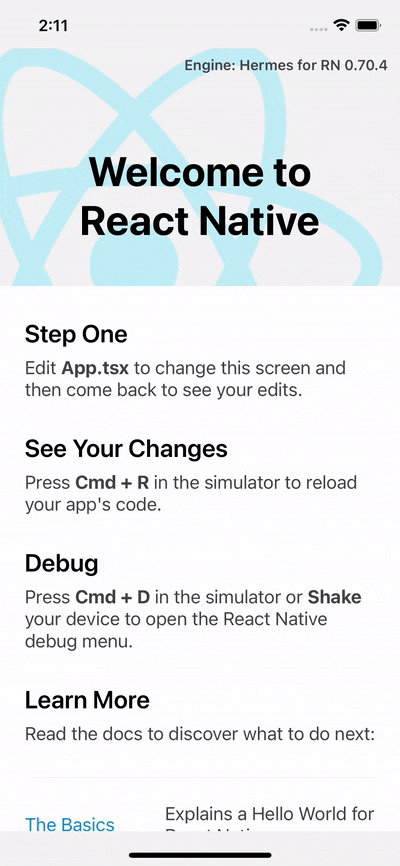

# @sherlo/react-native-storybook

This package is a critical component of the Visual Testing solution provided by Sherlo, designed for projects with [Storybook React Native](https://github.com/storybookjs/react-native) integration. It allows selective visibility between your app and Storybook within Sherlo's infrastructure emulators or when manually toggled via the React Native development menu.

## Requirements

- `@storybook/react-native` version `>= 7.6.15`
- `react-native` version `>=0.57.0`
- `@react-native-async-storage/async-storage` version `*`

## Features

- **Toggle Visibility**: Allows toggling between the app and Storybook via the React Native dev menu. The selected state persists across app refreshes.

- **Control and Monitor Storybook**: Enables Sherlo to control which stories are rendered, monitor app state, communicate with the test runner, and capture screenshots during visual testing.

## Installation

To install the package along with its dependency, use the following commands via npm or yarn:

**npm**

```npm
npm install @sherlo/react-native-storybook @react-native-async-storage/async-storage
```

**yarn**

```yarn
yarn add @sherlo/react-native-storybook @react-native-async-storage/async-storage
```

## Integration

### Wrapping Your Application

Wrap your application in `withStorybook` to toggle between your app and Storybook based on Sherlo's testing environment or manual toggling.

For **Expo** projects in `App.tsx`:

```tsx
import { withStorybook } from '@sherlo/react-native-storybook';
import Storybook from './.storybook';
import AppRoot from './AppRoot'; // Your root App component

export default withStorybook(App, Storybook);
```

For **bare React Native** projects in `index.ts`:

```typescript
import { AppRegistry } from 'react-native';
import { withStorybook } from '@sherlo/react-native-storybook';
import Storybook from './storybook';
import AppRoot from './AppRoot'; // Your root App component

AppRegistry.registerComponent('your_app_name', () => withStorybook(AppRoot, Storybook));
```

### Configuring Storybook

Wrap your Storybook configuration in `withSherlo` for development or testing modes and to control the testing process through storybook events.

In your `.storybook/index.ts` file:

```tsx
import { withSherlo } from '@sherlo/react-native-storybook';
import { view } from './storybook.requires';

export default withSherlo(view, {
  // ...here put your view.getStorybookUI() arguments
});
```

## Usage

To use the toggle feature during development:

1. Open the React Native development menu in your emulator or device.
2. Select 'Toggle Storybook' to switch between your app and Storybook. This choice is persisted across app sessions until toggled again.

<p align="center">
  
</p>

Sherlo will automatically use this package to control and test Storybook components when running visual tests in its infrastructure.
